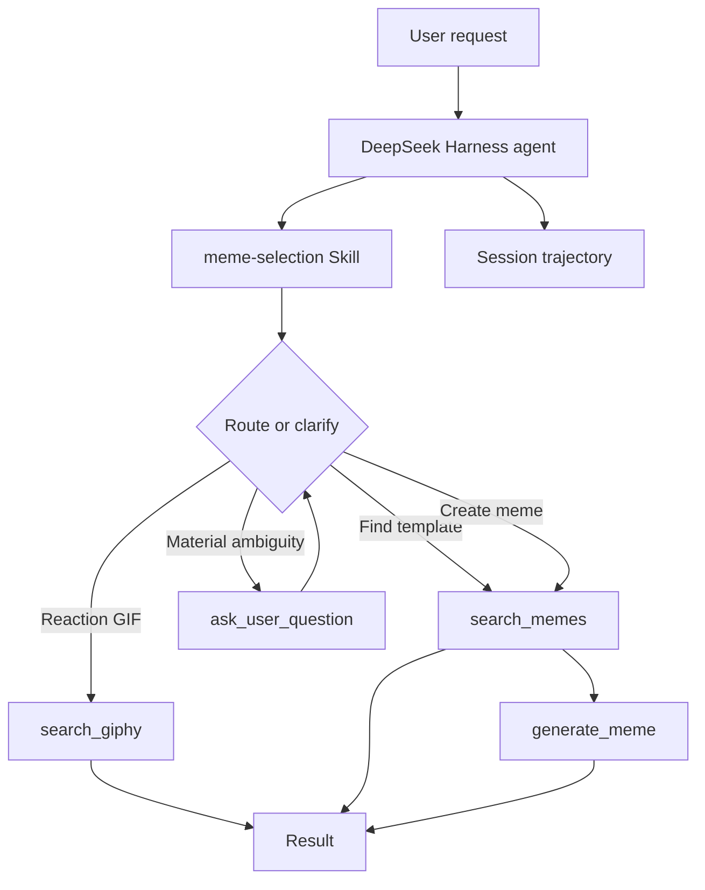

# Architecture

## Purpose

My Meme is a DeepSeek Harness agent that returns either an existing reaction GIF, an existing meme template, or a newly captioned meme. The design keeps content selection in a Skill and external actions in Tools.

## Current architecture



### DeepSeek Harness

Harness provides the agent runtime, Skill and plugin discovery, tool execution, conversation context, sessions, and append-only trajectory events. Those events are the observable record used by the behavior evaluator.

### `meme-selection` Skill

The Skill is the behavioral policy for the agent. It currently defines:

- how to infer whether the user wants a reaction GIF, an existing template, or a custom meme;
- when an ambiguous visual request requires clarification;
- the exception for explicit delegation such as “you choose what works best”;
- when to search before generating and when an exact template ID permits direct generation;
- bounded search, retry, and stop behavior;
- preservation of explicit user constraints during fallback.

The Skill is stored at `.agents/skills/meme-selection/SKILL.md` at the enclosing repository root.

### Tools

| Tool | Responsibility | External service |
|---|---|---|
| `search_memes` | Search and rank existing meme templates. | Memegen |
| `generate_meme` | Caption a known, valid template ID. | Memegen |
| `search_giphy` | Search for reaction GIFs. | GIPHY |

Tools perform bounded external actions and return structured results. They do not own routing policy.

## Agent loop and trajectory

The runtime loop is:

```text
user goal -> model decision -> tool call -> observation -> next decision -> stop
```

A tool execution can produce three materially different observations:

- useful result: continue or complete;
- successful empty or irrelevant result: refine once, choose a valid fallback, or stop;
- tool error: classify as retryable or non-retryable, then retry, change strategy, or explain.

The trajectory records events such as `user/message`, `assistant/message`, `tool/call`, and `tool/result`. Tool-call `seq` values provide deterministic ordering for evaluations.

## State, session, and memory boundaries

| Concept | Current role | Status |
|---|---|---|
| Conversation history | Lets the model resolve short references such as a previous caption or candidate. | Implemented by the session context. |
| Session | Defines one interaction lifecycle and stores its event log. | Implemented by Harness. |
| Explicit agent state | Would store fields such as candidates, selected template, current caption, and prior caption. | Not implemented; current short flows do not yet justify it. |
| Long-term memory | Would persist user preferences or facts across sessions. | Not implemented. |

History is a record of what happened; explicit state would represent what is currently true. Add explicit state only when longer editing flows, UI synchronization, or reliable references make semantic reconstruction from history insufficient.

## Error handling and fallback

Current policy distinguishes retry from fallback:

- Retry repeats an action only for a plausibly transient failure and remains bounded.
- Fallback changes the implementation path after checking that the user’s goal and explicit constraints remain satisfied.
- A nonexistent template ID should not be retried unchanged; the agent may resolve a valid template only when doing so preserves intent.
- An explicit GIF request must not silently fall back to a static meme.
- A format-flexible request may fall back from GIPHY to Memegen.

## Human in the loop

The agent asks the user only when a missing decision materially changes the result and cannot reasonably be inferred or has not been delegated. For an unspecified visual format, it asks the user to choose a reaction GIF, a custom meme, or both before calling a content tool.

It should not ask when the request is sufficiently specific or the user explicitly delegates the decision.

## Implemented and verified

- Skill-driven routing among the three business tools.
- Direct generation for a valid explicit template ID.
- Clarification before action for materially ambiguous visual requests.
- Bounded retry and fallback behavior observed in trajectories.
- Session-event-based behavior evaluation.
- SDK composition smoke test for Skill and tool availability.
- Automated isolated E1–E5 execution through the Harness Python SDK.

## Current limitations

- No explicit task-state model or persistent memory.
- No semantic or visual-quality evaluator.
- No RAG, MCP integration, or multi-agent architecture.
- The current Cordis plugin configuration includes a local absolute plugin path and is not yet portable across machines.

## Next step

Evaluate whether required Tool calls complete successfully and return the minimum normalized fields needed for a usable meme, GIF, or generated artifact. Keep semantic relevance and visual quality as separate later concerns.
